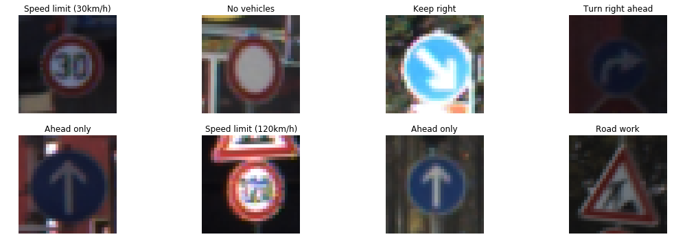
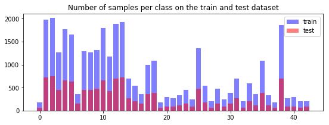
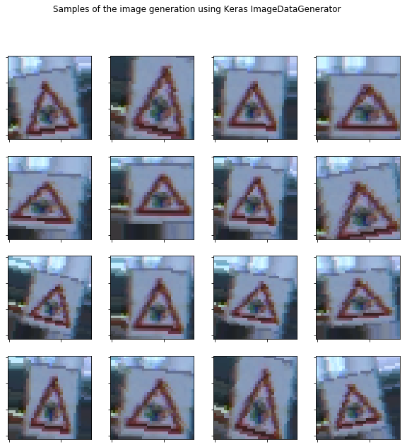
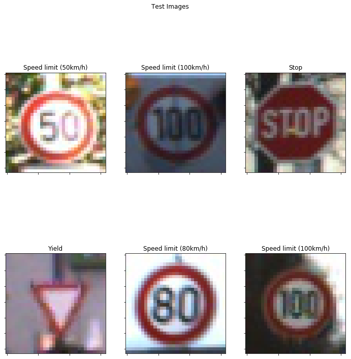

# Self-Driving Car Engineer Nanodegree

## Deep Learning

## Project: Build a Traffic Sign Recognition Classifier

In this notebook, a template is provided for you to implement your functionality in stages, which is required to successfully complete this project. If additional code is required that cannot be included in the notebook, be sure that the Python code is successfully imported and included in your submission if necessary. 

> **Note**: Once you have completed all of the code implementations, you need to finalize your work by exporting the iPython Notebook as an HTML document. Before exporting the notebook to html, all of the code cells need to have been run so that reviewers can see the final implementation and output. You can then export the notebook by using the menu above and navigating to  \n",
    "**File -> Download as -> HTML (.html)**. Include the finished document along with this notebook as your submission. 

In addition to implementing code, there is a writeup to complete. The writeup should be completed in a separate file, which can be either a markdown file or a pdf document. There is a [write up template](https://github.com/udacity/CarND-Traffic-Sign-Classifier-Project/blob/master/writeup_template.md) that can be used to guide the writing process. Completing the code template and writeup template will cover all of the [rubric points](https://review.udacity.com/#!/rubrics/481/view) for this project.

The [rubric](https://review.udacity.com/#!/rubrics/481/view) contains "Stand Out Suggestions" for enhancing the project beyond the minimum requirements. The stand out suggestions are optional. If you decide to pursue the "stand out suggestions", you can include the code in this Ipython notebook and also discuss the results in the writeup file.


>**Note:** Code and Markdown cells can be executed using the **Shift + Enter** keyboard shortcut. In addition, Markdown cells can be edited by typically double-clicking the cell to enter edit mode.

---
## Step 0: Load The Data


```python
# Load pickled data
import pickle
from sklearn.model_selection import train_test_split

# TODO: Fill this in based on where you saved the training and testing data

training_file = "data/train.p"
testing_file  = "data/test.p"

with open(training_file, mode='rb') as f:
    train = pickle.load(f)
with open(testing_file, mode='rb') as f:
    test = pickle.load(f)
    
X_train, y_train = train['features'], train['labels']
X_test,  y_test  = test['features'],  test['labels']

print("The data has been loaded.")
```

    <class 'numpy.ndarray'>
    The data has been loaded.


## Step 1: Dataset Summary & Exploration

The pickled data is a dictionary with 4 key/value pairs:

- `'features'` is a 4D array containing raw pixel data of the traffic sign images, (num examples, width, height, channels).
- `'labels'` is a 1D array containing the label/class id of the traffic sign. The file `signnames.csv` contains id -> name mappings for each id.
- `'sizes'` is a list containing tuples, (width, height) representing the the original width and height the image.
- `'coords'` is a list containing tuples, (x1, y1, x2, y2) representing coordinates of a bounding box around the sign in the image. **THESE COORDINATES ASSUME THE ORIGINAL IMAGE. THE PICKLED DATA CONTAINS RESIZED VERSIONS (32 by 32) OF THESE IMAGES**

Complete the basic data summary below. Use python, numpy and/or pandas methods to calculate the data summary rather than hard coding the results. For example, the [pandas shape method](http://pandas.pydata.org/pandas-docs/stable/generated/pandas.DataFrame.shape.html) might be useful for calculating some of the summary results. 

### Provide a Basic Summary of the Data Set Using Python, Numpy and/or Pandas

#### 1. Provide a basic summary of the data set and identify where in your code the summary was done. In the code, the analysis should be done using python, numpy and/or pandas methods rather than hardcoding results manually.

This is implemented in the next cell. I used the shapes of the lists that are loaded with the training a test sets, and for the image shape, I used the dimensions of the test list, that indicates on the last 3 index the image shape.

To analyze the number of samples per class in the test dataset vs the train dataset, in the cell after the next one. For this, I used pyplot to create a graph with this information. Also, I used pyplot to create a visualization of random samples in the dataset.


```python
### Replace each question mark with the appropriate value. 
### Use python, pandas or numpy methods rather than hard coding the results
import pandas as pd

# TODO: Number of training examples
n_train = X_train.shape[0]

# TODO: Number of testing examples.
n_test = X_test.shape[0]

# TODO: What's the shape of an traffic sign image?
image_shape = X_test.shape[1:4]

# TODO: How many unique classes/labels there are in the dataset.
reader        = pd.read_csv('signnames.csv')
classes_names = reader['SignName'].values
n_classes     = len(classes_names)

print("Number of training examples =", n_train)
print("Number of testing examples  =", n_test)
print("Image data shape            =", image_shape)
print("Number of classes           =", n_classes)
```

    Number of training examples = 34799
    Number of testing examples  = 12630
    Image data shape            = (32, 32, 3)
    Number of classes           = 43


### Include an exploratory visualization of the dataset

Visualize the German Traffic Signs Dataset using the pickled file(s). This is open ended, suggestions include: plotting traffic sign images, plotting the count of each sign, etc.

The [Matplotlib](http://matplotlib.org/) [examples](http://matplotlib.org/examples/index.html) and [gallery](http://matplotlib.org/gallery.html) pages are a great resource for doing visualizations in Python.

**NOTE:** It's recommended you start with something simple first. If you wish to do more, come back to it after you've completed the rest of the sections.

#### 2. Include an exploratory visualization of the dataset and identify where the code is in your code file.

This is implemented in the next cell.


```python
### Data exploration visualization code goes here.
### Feel free to use as many code cells as needed.
import random
import numpy             as np
import matplotlib.pyplot as plt
# Visualizations will be shown in the notebook.
%matplotlib inline

fig, axes = plt.subplots(nrows=2, ncols=4, figsize=(15, 5))
axes = axes.ravel()
fig.tight_layout()

for i in range(8):
    index = random.randint(0, len(X_train))
    axes[i].imshow(X_train[index])
    axes[i].set_title(classes_names[y_train[index]])
    axes[i].axis('off')

train_classes = np.bincount(y_train)
test_classes  = np.bincount(y_test)

plt.figure(figsize=(9, 3))
plt.bar(range(n_classes), train_classes, label="train", color="b", alpha=0.5)
plt.bar(range(n_classes), test_classes,  label="test",  color="r", alpha=0.5)
plt.legend(loc="best")
plt.title("Number of samples per class on the train and test dataset")
```


    <matplotlib.text.Text at 0x7f67596f78d0>








----

## Step 2: Design and Test a Model Architecture

Design and implement a deep learning model that learns to recognize traffic signs. Train and test your model on the [German Traffic Sign Dataset](http://benchmark.ini.rub.de/?section=gtsrb&subsection=dataset).

There are various aspects to consider when thinking about this problem:

- Neural network architecture
- Play around preprocessing techniques (normalization, rgb to grayscale, etc)
- Number of examples per label (some have more than others).
- Generate fake data.

Here is an example of a [published baseline model on this problem](http://yann.lecun.com/exdb/publis/pdf/sermanet-ijcnn-11.pdf). It's not required to be familiar with the approach used in the paper but, it's good practice to try to read papers like these.

**NOTE:** The LeNet-5 implementation shown in the [classroom](https://classroom.udacity.com/nanodegrees/nd013/parts/fbf77062-5703-404e-b60c-95b78b2f3f9e/modules/6df7ae49-c61c-4bb2-a23e-6527e69209ec/lessons/601ae704-1035-4287-8b11-e2c2716217ad/concepts/d4aca031-508f-4e0b-b493-e7b706120f81) at the end of the CNN lesson is a solid starting point. You'll have to change the number of classes and possibly the preprocessing, but aside from that it's plug and play!

### Pre-process the Data Set (normalization, grayscale, etc.)

Use the code cell (or multiple code cells, if necessary) to implement the first step of your project.

#### 1. Describe how, and identify where in your code, you preprocessed the image data. What tecniques were chosen and why did you choose these techniques? Consider including images showing the output of each preprocessing technique. Pre-processing refers to techniques such as converting to grayscale, normalization, etc.

The next cell describes the functions I used to preprocess the image data, and also to augment the data set.

I decided to keep the images on color, so I can capture more features, and make the classifier to yield better results with the random testing data. I chose to convert the images to YUV (as suggested by Yann LeCun [Traffic Sign Recognition with Multi-Scale Convolutional Networks](http://yann.lecun.com/exdb/publis/pdf/sermanet-ijcnn-11.pdf). I also did histogram equalization, to improve the contrast of the image. I normalize the image data to a range of 0 to 1, by dividing it by 255. This is done in the next cell.


```python
### Preprocess the data here. Preprocessing steps could include normalization, converting to grayscale, etc.
### Feel free to use as many code cells as needed.

import cv2
from sklearn.utils import shuffle

def preprocess_dataset(data):
    #data = (data - np.mean(data)) / np.std(data)  
    data = cv2.cvtColor(data, cv2.COLOR_RGB2YUV)
    data = cv2.equalizeHist(data)
    return data / 255

map(preprocess_dataset, X_train)
map(preprocess_dataset, X_test)

X_train, y_train = shuffle(X_train, y_train)

X_train, X_valid, y_train, y_valid = train_test_split(X_train, y_train, test_size = 0.3, random_state = 42)

input_depth = 3
```

#### 2. Describe how, and identify where in your code, you set up training, validation and testing data. How much data was in each set? Explain what techniques were used to split the data into these sets. (OPTIONAL: As described in the "Stand Out Suggestions" part of the rubric, if you generated additional data for training, describe why you decided to generate additional data, how you generated the data, identify where in your code, and provide example images of the additional data)

The data split up was done after preprocessing the data, in the cell 4. I used the function **sklearn.model_selection.train_test_split** to split the data set in two, taking the 30% of the data for validation, and the rest for training. 

I also decided to do data augmentation, given that in the dataset only a few classes have the majority of samples. For this, I used **keras.preprocessing.image.ImageDataGenerator**, that does random transformations to a given set of images an can generate batches for training.


```python
from keras.preprocessing.image import ImageDataGenerator

data_generator = ImageDataGenerator(rotation_range    = 15.,
                                   zoom_range         = 0.3,
                                   width_shift_range  = 0.1,
                                   height_shift_range = 0.1)
```

    Using TensorFlow backend.


This is are sample images of the data augmentation:


```python
index       = random.randint(0, len(X_train))
image       = X_train[index]

fig, axes = plt.subplots(4, 4, figsize = (10, 10))

for ax in axes.ravel():
    transformed_img, _ = data_generator.flow(np.expand_dims(image, 0), y_train[index : index + 1]).next()
    ax.imshow(np.uint8(np.squeeze(transformed_img)))
    
plt.setp([a.get_xticklabels() for a in axes.ravel()], visible=False)
plt.setp([a.get_yticklabels() for a in axes.ravel()], visible=False)
plt.suptitle('Samples of the image generation using Keras ImageDataGenerator')
plt.show()

```





### Model Architecture

#### 3. Describe, and identify where in your code, what your final model architecture looks like including model type, layers, layer sizes, connectivity, etc.) Consider including a diagram and/or table describing the final model.

For my model, I used LeNet as explained in the lessons. However, I change the pooling for an average pooling, so there's no loss of information for example by using max pooling. This is implemented in cell 9. 

In previous versions of the model, I tried using dropouts; however, with the dropouts (with p = 0.9, 0.5 and 0.1) the accuracy had a lot of variability, and the model required around 50 epochs to get an accuracy of 96%.  


```python
import tensorflow as tf

PADDING_SAME  = 'SAME'
PADDING_VALID = 'VALID'

def get_tensor(shape):
    # Returns a tensor with the given shape.
    return tf.Variable(tf.truncated_normal(shape, mean = 0, stddev = 0.1))

def get_zero_tensor(shape):
    # Returns a tensor filled with zeroes with the given shape.
    return tf.Variable(tf.zeros(shape))

def get_convolution2D(x, shape, stride, padding):
    # returns a 2D convolution
    w    = get_tensor(shape)
    b    = get_zero_tensor(shape[-1])
    conv = tf.nn.conv2d(x, w, strides=[1, stride, stride, 1], padding = padding)
    conv = tf.nn.bias_add(conv, b)
    return conv

def get_relu(x):
    # returns a relu activation.
    return tf.nn.relu(x)

def get_max_pooling(x, k, stride, padding):
    # returns a max pooling node.
    return tf.nn.max_pool(x, ksize = [1, k, k, 1], strides = [1, stride, stride, 1], padding = padding)

def get_average_pooling(x, k, stride, padding):
    return tf.nn.avg_pool(x, ksize = [1, k, k, 1], strides = [1, stride, stride, 1], padding = padding)

def get_dropout(x, probability):
    # returns a dropout node.
    return tf.nn.dropout(x, probability)

def get_fully_connected(x, shape):
    # returns a fully connected layer.
    w  = get_tensor(shape)
    b  = get_zero_tensor(shape[-1])
    fc = tf.matmul(x, w)
    fc = tf.nn.bias_add(fc, b)
    return fc
```


```python
### Define your architecture here.
### Feel free to use as many code cells as needed.
from tensorflow.contrib.layers import flatten

def buildClassifier(x, n_classes, input_depth = 3):  
    # Builds the classifier.
    dropout_p = 0.1
    padding   = PADDING_VALID
    
    # Layer 1: Convolutional. Input = 32x32x1. Output = 28x28x6.
    layers = get_convolution2D(x, (5, 5, input_depth, 6), 1, padding)
    # Activation.
    layers = get_relu(layers)
    # Pooling. Input = 28x28x6. Output = 14x14x6.
    layers = get_average_pooling(layers, 2, 2, padding)
    # Dropout 
    #layers = get_dropout(layers, dropout_p)
    # Layer 2: Convolutional. Input = 14x14x6. Output = 10x10x16.
    layers = get_convolution2D(layers, (5, 5, 6, 16), 1, padding)
    # Activation.
    layers = get_relu(layers)
    # Pooling. Input = 10x10x16. Output = 5x5x16.
    layers = get_average_pooling(layers, 2, 2, padding)
    # Dropout 
    #layers = get_dropout(layers, dropout_p)
    # Flatten. Input = 5x5x16. Output = 400.
    layers = flatten(layers)
    # Layer 3: Fully Connected. Input = 400. Output = 120.
    layers = get_fully_connected(layers, shape=(400, 120))    
    # Activation.
    layers = get_relu(layers)
    # Layer 4: Fully Connected. Input = 120. Output = 84.
    layers = get_fully_connected(layers, shape=(120, 84)) 
    # SOLUTION: Activation.
    layers = get_relu(layers)
    # Layer 5: Fully Connected. Input = 84. Output = 43.
    layers = get_fully_connected(layers, shape=(84, n_classes)) 
    return layers
```

### Features and Labels


```python
x         = tf.placeholder(tf.float32, (None, 32, 32, input_depth))
y         = tf.placeholder(tf.int32, (None))
one_hot_y = tf.one_hot(y, n_classes)
```

### Training Pipeline

A validation set can be used to assess how well the model is performing. A low accuracy on the training and validation
sets imply underfitting. A high accuracy on the test set but low accuracy on the validation set implies overfitting.


```python
rate = 0.001

logits             = buildClassifier(x, n_classes, input_depth)
cross_entropy      = tf.nn.softmax_cross_entropy_with_logits(logits, one_hot_y)
loss_operation     = tf.reduce_mean(cross_entropy)
optimizer          = tf.train.AdamOptimizer(learning_rate = rate)
training_operation = optimizer.minimize(loss_operation)
```

### Model Evaluation


```python
correct_prediction = tf.equal(tf.argmax(logits, 1), tf.argmax(one_hot_y, 1))
accuracy_operation = tf.reduce_mean(tf.cast(correct_prediction, tf.float32))
saver              = tf.train.Saver()

EPOCHS        = 10
BATCH_SIZE    = 128
TOTAL_BATCHES = 4000

def evaluate(X_data, y_data):
    num_examples   = len(X_data)
    total_accuracy = 0
    sess           = tf.get_default_session()
    
    for offset in range(0, num_examples, BATCH_SIZE):
        batch_x, batch_y = X_data[offset:offset + BATCH_SIZE], y_data[offset:offset + BATCH_SIZE]
        accuracy         = sess.run(accuracy_operation, feed_dict = { x: batch_x, y: batch_y })
        total_accuracy  += (accuracy * len(batch_x))
        
    return total_accuracy / num_examples
```

### Model Training
#### 4. Describe how, and identify where in your code, you trained your model. The discussion can include the type of optimizer, the batch size, number of epochs and any hyperparameters such as learning rate.

The model training is done on the next cell. I used 10 epochs, to prevent overfitting. In previous trainings, after 9 or 10 iterations I observed the accuracy was dropping, or given consistently the same result. I also used the AdamOptimizer.

I tried changing the learning rate, and the best result I got was with 0.001. That value worked well with batch size = 128. 

The number of batches was set to 4000, considering that the data augmentation could occur around 20 times per image.


```python
with tf.Session() as sess:
    sess.run(tf.global_variables_initializer())
    
    print("Training...")
    print()
    
    for i in range(EPOCHS):
        X_train, y_train  = shuffle(X_train, y_train)  
        processed_batches = 0
    
        for batch_x, batch_y in data_generator.flow(X_train, y_train, batch_size = BATCH_SIZE):
            processed_batches += 1
            
            sess.run(training_operation, feed_dict={x: batch_x, y: batch_y})

            if processed_batches == TOTAL_BATCHES:
                break
        
        train_accuracy      = evaluate(X_train, y_train)
        validation_accuracy = evaluate(X_valid, y_valid)
        print("EPOCH {} - Training Accuracy = {:.3f}, Accuracy = {:.3f}".format(i + 1, train_accuracy, validation_accuracy))
        
    saver.save(sess, './traffic-sign-classifier')
    print("Model saved")
```

    Training...
    
    EPOCH 1 - Training Accuracy = 0.956, Accuracy = 0.953
    EPOCH 2 - Training Accuracy = 0.985, Accuracy = 0.982
    EPOCH 3 - Training Accuracy = 0.987, Accuracy = 0.987
    EPOCH 4 - Training Accuracy = 0.990, Accuracy = 0.983
    EPOCH 5 - Training Accuracy = 0.993, Accuracy = 0.991
    EPOCH 6 - Training Accuracy = 0.995, Accuracy = 0.992
    EPOCH 7 - Training Accuracy = 0.994, Accuracy = 0.992
    EPOCH 8 - Training Accuracy = 0.997, Accuracy = 0.996
    EPOCH 9 - Training Accuracy = 0.996, Accuracy = 0.993
    EPOCH 10 - Training Accuracy = 0.997, Accuracy = 0.995
    Model saved


### Model Testing


```python
# testing the model
with tf.Session() as sess:

    # restore saved session with highest validation accuracy
    saver.restore(sess, './traffic-sign-classifier')
    
    test_accuracy = evaluate(X_test, y_test)
    print('Accuracy on test set: {:.3f}'.format(test_accuracy))
```

    Accuracy on test set: 0.942


#### 5. Describe the approach taken for finding a solution. Include in the discussion the results on the training, validation and test sets and where in the code these were calculated. Your approach may have been an iterative process, in which case, outline the steps you took to get to the final solution and why you chose those steps. Perhaps your solution involved an already well known implementation or architecture. In this case, discuss why you think the architecture is suitable for the current problem.

To solve this problem, I took LeNet architecture as my starting point, given that we studied it before and the one on the lesson execise could be more accurate with only a few changes. Then, I tested different approachs to preprocess the data, in which I tried grayscaled images, normalizing by mean, histogram equalization, etc. I trained the model several times with smaller datasets to see the accuracy I could get. I wasn't happy with the first results, that yielded an accuracy around 94% (even changing the hyperparameters), so then I tried data augmentation.

With data augmentation, I tried first implementing it by myself. I ran tests doing random transformations to images in the data set (gaussian blur, random translation, random rotation, or return the same image). In this tests, the performance was poor, the accuracy was still very variable, and required more than 30 epochs without settling on a consistent accuracy. I guess this has to do with the transformations I was doing, that was creating images that were too different from the rest of the dataset. In the end, I decided to use the image data generator Keras implemented, with very small values, that will yield more similar images. 

After the final solution, I got a **training accuracy of 0.997**, a **validation set accuracy of 0.995**, and an **accuracy with the test set of 0.942**, as indicated above.

---

## Step 3: Test a Model on New Images

To give yourself more insight into how your model is working, download at least five pictures of German traffic signs from the web and use your model to predict the traffic sign type.

You may find `signnames.csv` useful as it contains mappings from the class id (integer) to the actual sign name.

### Load and Output the Images

#### 1. Choose five candidate images of traffic signs and provide them in the report. Are there any particular qualities of the image(s) that might make classification difficult? It could be helpful to plot the images in the notebook.

This are images taken from videos and unknown sources on internet, so maybe they are not in the best conditions to be used first hand for the classifier. Some are obscured, and others have image distortions (for example the distortion on the stop sign merging parts of the middle letters) that can make them harder to classify.


```python
### Load the images and plot them here.
### Feel free to use as many code cells as needed.
import glob
import ntpath
import matplotlib.image as mpimg

SAMPLES_TO_LOAD = 6

test_images  = glob.glob('test_images/*.jpg', recursive = True)
#X_new_images = np.empty((SAMPLES_TO_LOAD, 32, 32, 3), dtype=np.uint8)
X_new_images = []
y_new_images = []

for i in range(SAMPLES_TO_LOAD):
    filename       = test_images[i]
    label          = int(ntpath.basename(filename).split('-')[0])
    #test_images[i] = mpimg.imread(filename)
    X_new_images.append(mpimg.imread(filename))
    y_new_images.append(label)

X_new_images = np.asarray(X_new_images, dtype=np.uint8, order=None)
    
fig, axes    = plt.subplots(2, 3, figsize = (12, 12))
sample_index = 0

for ax in axes.ravel():
    ax.set_title(classes_names[y_new_images[sample_index]])
    ax.imshow(X_new_images[sample_index])
    sample_index += 1
    
plt.setp([a.get_xticklabels() for a in axes.ravel()], visible=False)
plt.setp([a.get_yticklabels() for a in axes.ravel()], visible=False)
plt.suptitle('Test Images')
plt.show()

```





### Predict the Sign Type for Each Image

#### 2. Is your model able to perform equally well on captured pictures when compared to testing on the dataset? The simplest way to do this check the accuracy of the predictions. For example, if the model predicted 1 out of 5 signs correctly, it's 20% accurate.
NOTE: You could check the accuracy manually by using signnames.csv (same directory). This file has a mapping from the class id (0-42) to the corresponding sign name. So, you could take the class id the model outputs, lookup the name in signnames.csv and see if it matches the sign from the image.


```python
# Preprocess images
map(preprocess_dataset, X_new_images)

with tf.Session() as sess:
    
    # restore saved session with highest validation accuracy
    saver.restore(sess, './traffic-sign-classifier')
    
    # make prediction
    prediction = np.argmax(np.array(sess.run(logits, feed_dict={x: X_new_images})), axis=1)
```

### Analyze Performance


```python
### Calculate the accuracy for these 5 new images. 
### For example, if the model predicted 1 out of 5 signs correctly, it's 20% accurate on these new images.
for i, pred in enumerate(prediction):
    print('Image {} - Target = {}, Predicted = {}'.format(i, classes_names[y_new_images[i]], classes_names[pred]))
    
print('> Model accuracy: {:.02f}'.format(np.sum(y_new_images == prediction) / len(y_new_images)))
```

    Image 0 - Target = Speed limit (50km/h), Predicted = Speed limit (50km/h)
    Image 1 - Target = Speed limit (100km/h), Predicted = Speed limit (100km/h)
    Image 2 - Target = Stop, Predicted = Stop
    Image 3 - Target = Yield, Predicted = Yield
    Image 4 - Target = Speed limit (80km/h), Predicted = Speed limit (80km/h)
    Image 5 - Target = Speed limit (100km/h), Predicted = Speed limit (100km/h)
    > Model accuracy: 1.00


All the chosen images were predicted correctly by the model, giving an accuracy of 1.0. In the next section, the softmax probabilities for each image are shown.

### Output Top 5 Softmax Probabilities For Each Image Found on the Web

For each of the new images, print out the model's softmax probabilities to show the **certainty** of the model's predictions (limit the output to the top 5 probabilities for each image). [`tf.nn.top_k`](https://www.tensorflow.org/versions/r0.12/api_docs/python/nn.html#top_k) could prove helpful here. 


```python
### Print out the top five softmax probabilities for the predictions on the German traffic sign images found on the web. 
### Feel free to use as many code cells as needed.
softmax = tf.nn.softmax(logits)
top_k   = tf.nn.top_k(softmax, 5)

with tf.Session() as sess:
    saver.restore(sess, './traffic-sign-classifier')

    values, indices = sess.run(top_k, feed_dict={x:X_new_images})
    
    for i in range(len(values)):
        print("Image {}:".format(i))
        values[i].sort()
        sorted_p = values[i][::-1]
        for j in range(len(sorted_p)):
            print(" * P{}: {} - {}".format(j, sorted_p[j], classes_names[indices[i][j]]))
        
```

    Image 0:
     * P0: 1.0 - Speed limit (50km/h)
     * P1: 3.849955909629443e-09 - Speed limit (30km/h)
     * P2: 3.01029444698276e-14 - Speed limit (80km/h)
     * P3: 1.6174736814069594e-15 - Speed limit (70km/h)
     * P4: 3.424892109029364e-18 - Speed limit (60km/h)
    Image 1:
     * P0: 0.9955766201019287 - Speed limit (100km/h)
     * P1: 0.0037285303696990013 - Speed limit (30km/h)
     * P2: 0.0003500601160340011 - Speed limit (120km/h)
     * P3: 0.00018746232672128826 - Speed limit (80km/h)
     * P4: 0.00015264291141647846 - Speed limit (50km/h)
    Image 2:
     * P0: 1.0 - Stop
     * P1: 1.7807285881992667e-15 - Speed limit (80km/h)
     * P2: 7.373621917382473e-16 - Speed limit (30km/h)
     * P3: 2.425289585538537e-17 - Speed limit (120km/h)
     * P4: 1.672467877842596e-17 - Speed limit (70km/h)
    Image 3:
     * P0: 1.0 - Yield
     * P1: 7.199763111002608e-16 - Stop
     * P2: 2.3159156621309373e-16 - No entry
     * P3: 1.369937884632106e-16 - No passing
     * P4: 4.2865379837485866e-21 - Speed limit (30km/h)
    Image 4:
     * P0: 0.9998868703842163 - Speed limit (80km/h)
     * P1: 0.00011295353760942817 - Speed limit (50km/h)
     * P2: 6.576684796755217e-08 - Speed limit (30km/h)
     * P3: 9.14544898145131e-11 - Speed limit (100km/h)
     * P4: 1.1101033287053141e-12 - Speed limit (60km/h)
    Image 5:
     * P0: 0.9999935626983643 - Speed limit (100km/h)
     * P1: 6.388734163920162e-06 - Speed limit (120km/h)
     * P2: 3.358402098085911e-11 - Speed limit (80km/h)
     * P3: 5.211523053383349e-12 - Speed limit (50km/h)
     * P4: 1.4412045775541449e-12 - Speed limit (70km/h)


> **Note**: Once you have completed all of the code implementations, you need to finalize your work by exporting the IPython Notebook as an HTML document. Before exporting the notebook to html, all of the code cells need to have been run. You can then export the notebook by using the menu above and navigating to  \n",
    "**File -> Download as -> HTML (.html)**. Include the finished document along with this notebook as your submission. 

### Project Writeup

Once you have completed the code implementation, document your results in a project writeup using this [template](https://github.com/udacity/CarND-Traffic-Sign-Classifier-Project/blob/master/writeup_template.md) as a guide. The writeup can be in a markdown or pdf file. 
